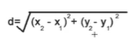
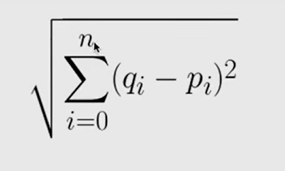

KNN
> Given a point , look at  k nearest neighbours and choose label based on most common label in those k nearest neighours\
>euclidean dist => 
>euclidian dist   (1 to  n)

_predict -> for each data point it gives a label -> compute distance for all, get k nearesst