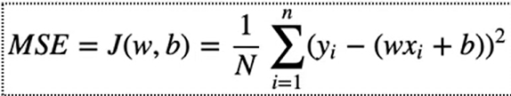
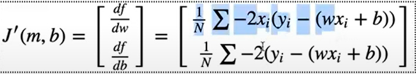
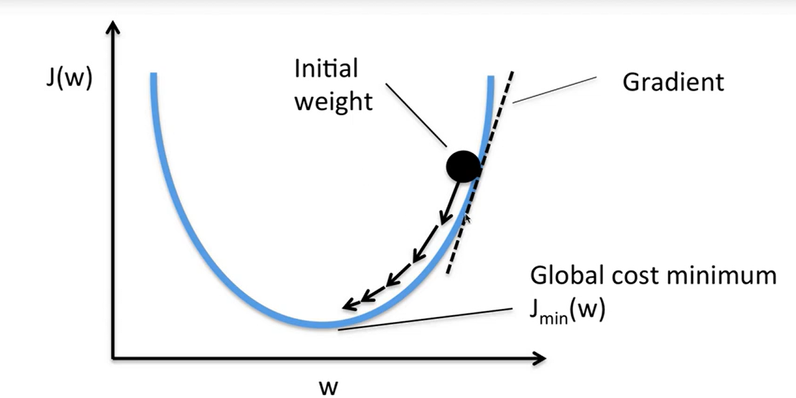

## liner Regression
y= wx + b
wieght and bias
## cost fun
> make this as smoll as possible
> MSE = cost

MSE= 1/n ∑ (actual value - predicted value)² or mean((actual-pred)**2)

f
## gradient 

>this is nothing but minimum of cost function

## gradient Descent 
> this is a technequie

### update rule
w = w - α . dw
b = b - α . db

α is learning rate
dw = derivative of weight

> from diffing mse we get
dw = 1/n ∑ 2X(y-yi)
db = 1/n ∑ 2(y-yi)
just two components of gradient nothing much

> -ve = because we minimizing

### α - learning rate
defines how far we go on each iteration

# Pythonic
 
 init -> lr, n_iters, weigts(None) , bias (None)
 
 fit -> 
 - n_samples (sample size) and n_features (feture size) are collected from X_train.shape
 - weights and bias is init as 0
 - in for loop of n_iters
 > - find y_pred (y = wx+b) and use gradient descent technique  to find dw and db
 > - use update method to update w and b
 
 predict -> since waights and bias is alreaddy updated in init by fir , now simple again get y_pred (y = wx+b)
 
 acc -> here we give out mse

